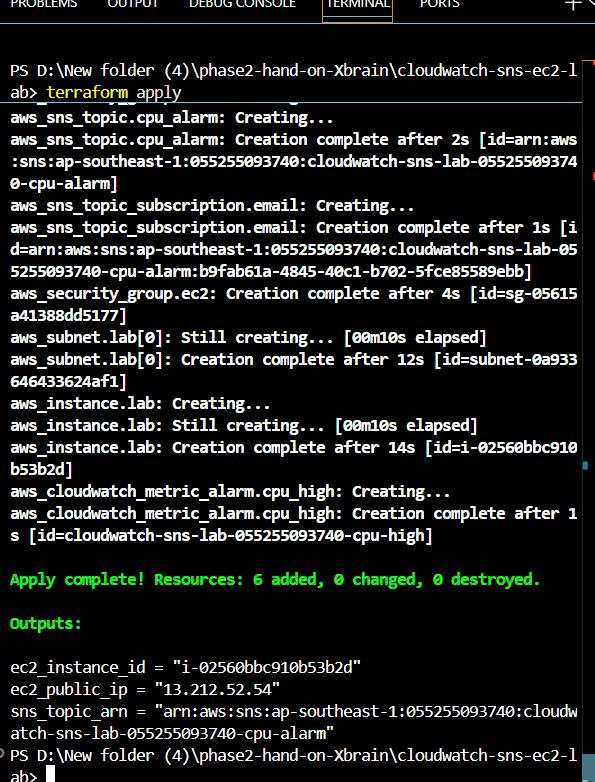
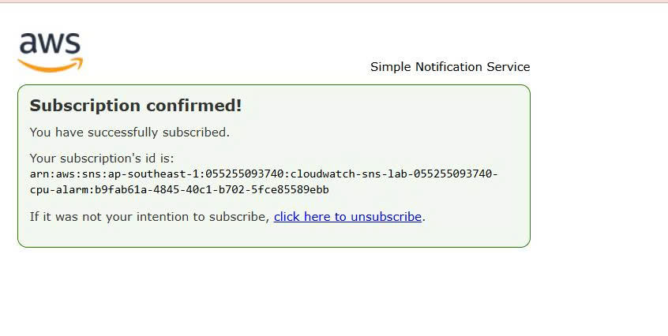
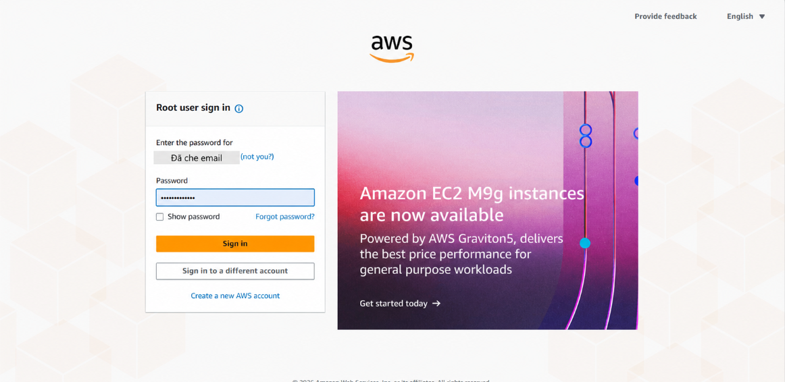
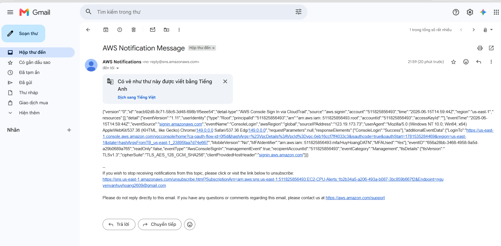

# CloudWatch CPU Alarm via SNS - Terraform Lab

## 1. Mục tiêu

Lab này triển khai hệ thống cảnh báo CPU cho EC2 bằng Terraform.

Khi CPU của EC2 vượt quá `80%` trong vòng `5 phút`, CloudWatch Alarm sẽ chuyển sang trạng thái `ALARM` và gửi cảnh báo đến email thông qua Amazon SNS.

Các mục tiêu chính:

* Tạo SNS Topic để nhận notification từ CloudWatch Alarm.
* Tạo Email Subscription cho SNS Topic.
* Tạo EC2 instance làm nguồn phát sinh CPU load.
* Tạo CloudWatch Alarm theo metric `CPUUtilization` của EC2.
* Kiểm tra email cảnh báo khi alarm chuyển sang trạng thái `ALARM`.
* Lưu evidence gồm ảnh apply Terraform, SNS subscription, CloudWatch Alarm và email alert.

---

## 2. Kiến trúc tổng quan

```txt
EC2 Instance
    |
    | CPUUtilization > 80% trong 5 phút
    v
CloudWatch Alarm
    |
    | Alarm state = ALARM
    v
SNS Topic
    |
    | Email Subscription
    v
Email Alert
```

Giải thích luồng hoạt động:

1. EC2 instance được tạo bằng Terraform.
2. EC2 chạy `user_data` để tạo CPU load.
3. CloudWatch theo dõi metric `CPUUtilization` của EC2.
4. Khi CPU vượt ngưỡng `80%`, CloudWatch Alarm chuyển sang trạng thái `ALARM`.
5. CloudWatch Alarm gửi notification đến SNS Topic.
6. SNS gửi email cảnh báo đến địa chỉ email đã subscribe.

---

## 3. Các file Terraform

Cấu trúc file trong lab:

```txt
.
├── main.tf
├── variables.tf
├── outputs.tf
├── terraform.tfvars.example
└── terraform.tfvars
```

Mô tả từng file:

| File                       | Chức năng                                                                    |
| -------------------------- | ---------------------------------------------------------------------------- |
| `main.tf`                  | Khai báo SNS Topic, SNS Email Subscription, EC2 instance và CloudWatch Alarm |
| `variables.tf`             | Khai báo các biến như region, email nhận cảnh báo, instance type, subnet     |
| `outputs.tf`               | Xuất ra các thông tin quan trọng như SNS Topic ARN và EC2 Instance ID        |
| `terraform.tfvars.example` | File mẫu để cấu hình email cảnh báo                                          |
| `terraform.tfvars`         | File cấu hình thật, chứa email nhận cảnh báo                                 |

---

## 4. Cách triển khai

### 4.1 Khởi tạo Terraform

Chạy lệnh:

```bash
terraform init
```

Mục đích:

* Tải AWS provider.
* Khởi tạo Terraform working directory.
* Chuẩn bị môi trường để chạy plan/apply.

---

### 4.2 Tạo file `terraform.tfvars`

Tạo file `terraform.tfvars` từ file mẫu:

```bash
copy terraform.tfvars.example terraform.tfvars
```

Sau đó chỉnh nội dung:

```hcl
alert_email = "your-email@example.com"
```

Nếu muốn chỉ định subnet cụ thể, có thể thêm:

```hcl
subnet_id = "subnet-xxxxxxxx"
```

Nếu không cấu hình `subnet_id`, Terraform sẽ tự động lấy subnet đầu tiên trong default VPC.

---

### 4.3 Apply Terraform

Chạy lệnh:

```bash
terraform apply
```

Sau đó nhập:

```bash
yes
```

Terraform sẽ tạo các tài nguyên chính:

* SNS Topic.
* SNS Email Subscription.
* EC2 instance.
* CloudWatch Alarm.
* Notification action từ CloudWatch Alarm đến SNS Topic.

Sau khi apply thành công, cần kiểm tra email và bấm xác nhận subscription từ AWS SNS.

---

### 4.4 Confirm SNS Email Subscription

Sau khi Terraform tạo SNS Email Subscription, AWS SNS sẽ gửi một email xác nhận.

Cần mở email và bấm:

```txt
Confirm subscription
```

Sau khi xác nhận, trạng thái subscription sẽ chuyển sang:

```txt
Confirmed
```

Lưu ý: Nếu chưa confirm subscription, SNS Topic sẽ chưa gửi được email alert.

---

### 4.5 Kiểm tra CloudWatch Alarm

Vào AWS Console:

```txt
CloudWatch → Alarms → All alarms
```

Chọn alarm đã tạo.

Alarm sẽ theo dõi metric:

```txt
EC2 → Per-Instance Metrics → CPUUtilization
```

Điều kiện alarm:

```txt
CPUUtilization > 80%
Period: 5 minutes
Datapoints to alarm: 1 out of 1
```

Khi EC2 tạo CPU load đủ lâu, alarm sẽ chuyển sang trạng thái:

```txt
ALARM
```

---

### 4.6 Kiểm tra Email Alert

Khi CloudWatch Alarm chuyển sang trạng thái `ALARM`, SNS sẽ gửi email cảnh báo đến địa chỉ email đã subscribe.

Email alert thường chứa các thông tin:

* Alarm name.
* Alarm state.
* Metric name: `CPUUtilization`.
* Threshold: lớn hơn `80%`.
* EC2 Instance ID.
* Thời gian alarm được kích hoạt.

---

### 4.7 Kiểm tra Terraform Output

Chạy lệnh:

```bash
terraform output
```

Kết quả cần kiểm tra:

```txt
sns_topic_arn
ec2_instance_id
```

Mục đích:

* Xác nhận Terraform đã tạo SNS Topic thành công.
* Xác nhận EC2 instance đã được tạo và đang được CloudWatch Alarm theo dõi.

---

### 4.8 Xóa tài nguyên sau lab

Sau khi hoàn thành lab và đã lưu evidence, có thể xóa tài nguyên để tránh phát sinh chi phí:

```bash
terraform destroy
```

Nhập:

```bash
yes
```

---

## 5. Evidence

Các evidence đã chuẩn bị cho lab:

### Evidence 1: Terraform Apply thành công

Ảnh chụp màn hình lệnh:

```bash
terraform apply
```

Kết quả thể hiện Terraform đã tạo thành công các tài nguyên:

* SNS Topic.
* SNS Subscription.
* EC2 Instance.
* CloudWatch Alarm.

---



### Evidence 2: SNS Email Subscription đã Confirm

Ảnh chụp SNS Subscription có trạng thái:

```txt
Confirmed
```

Điều này chứng minh email đã được đăng ký thành công với SNS Topic và có thể nhận cảnh báo.

---

### Evidence 3: CloudWatch Alarm chuyển sang trạng thái ALARM

Ảnh chụp CloudWatch Alarm có trạng thái:

```txt
In alarm
```

Điều này chứng minh CPU của EC2 đã vượt ngưỡng được cấu hình và CloudWatch Alarm hoạt động đúng.

---

### Evidence 4: Email Alert từ SNS

Ảnh chụp email cảnh báo được gửi từ AWS SNS.

Email này chứng minh luồng notification hoạt động thành công:

```txt
CloudWatch Alarm → SNS Topic → Email Subscription
```

---

### Evidence 5: Terraform Output

Ảnh chụp kết quả:

```bash
terraform output
```

Kết quả hiển thị:


Điều này chứng minh Terraform đang quản lý đúng các tài nguyên được tạo trong lab.

---

## 6. Kết quả đạt được

Lab đã hoàn thành thành công các yêu cầu:

* Đã triển khai hạ tầng bằng Terraform.
* Đã tạo SNS Topic và Email Subscription.
* Đã tạo EC2 instance làm nguồn tạo CPU load.
* Đã tạo CloudWatch Alarm theo metric `CPUUtilization`.
* Đã cấu hình alarm gửi notification đến SNS Topic.
* Đã nhận được email cảnh báo khi CPU vượt quá `80%`.
* Đã lưu evidence đầy đủ cho quá trình triển khai và kiểm thử.

---

## 7. Ghi chú

* Lab này sử dụng metric mặc định `CPUUtilization` của EC2, nên không cần cài CloudWatch Agent.
* CloudWatch Agent chỉ cần thiết khi muốn thu thập thêm custom metrics như memory usage, disk usage hoặc application logs.
* SNS Email Subscription bắt buộc phải được confirm thủ công trước khi nhận alert.
* EC2 sử dụng `user_data` để tạo CPU load tự động, nên không cần SSH vào máy để chạy stress test thủ công.
* Sau khi hoàn thành lab, nên chạy `terraform destroy` để tránh phát sinh chi phí không cần thiết.

---

## 8. Bổ sung: Cài đặt CloudWatch Agent trên EC2
**Mục tiêu:** Cài đặt CloudWatch Agent để thu thập các số liệu chuyên sâu từ hệ điều hành của EC2 (như Memory, Disk usage) và gửi lên hệ thống CloudWatch.

### 8.1 Điều kiện tiên quyết: Gắn IAM Role cho EC2
Đảm bảo EC2 đang được phân quyền IAM Role chứa Policy: **`CloudWatchAgentServerPolicy`**.

### 8.2 Cài đặt gói phần mềm Agent
Thực hiện kết nối SSH vào EC2 và chạy lệnh cài đặt:

- **Đối với hệ điều hành Amazon Linux:**
  ```bash
  sudo yum install amazon-cloudwatch-agent -y
  ```
- **Đối với hệ điều hành Ubuntu:**
  ```bash
  sudo apt-get update
  sudo apt-get install collectd -y
  wget https://amazoncloudwatch-agent.s3.amazonaws.com/ubuntu/amd64/latest/amazon-cloudwatch-agent.deb
  sudo dpkg -i -E ./amazon-cloudwatch-agent.deb
  ```

### 8.3 Khởi tạo tệp cấu hình bằng Wizard
Chạy lệnh sau để kích hoạt trình hướng dẫn (wizard) cấu hình:
```bash
sudo /opt/aws/amazon-cloudwatch-agent/bin/amazon-cloudwatch-agent-config-wizard
```
Có thể lựa chọn các thiết lập mặc định bằng cách nhấn Enter. Hệ thống sẽ sinh ra tệp cấu hình JSON tại thư mục cài đặt.

### 8.4 Kích hoạt Agent với cấu hình vừa tạo
Thực thi lệnh sau để nạp cấu hình (fetch-config) và khởi động CloudWatch Agent:
```bash
sudo /opt/aws/amazon-cloudwatch-agent/bin/amazon-cloudwatch-agent-ctl -a fetch-config -m ec2 -s -c file:/opt/aws/amazon-cloudwatch-agent/bin/config.json
```

### 8.5 Kiểm tra trạng thái hoạt động của Agent
Xác minh Agent đang chạy bình thường bằng câu lệnh:
```bash
sudo /opt/aws/amazon-cloudwatch-agent/bin/amazon-cloudwatch-agent-ctl -m ec2 -a status
```
Khi cài đặt thành công, trạng thái sẽ hiển thị `"status": "running"`.

---

## 9. Bổ sung: Cảnh báo đăng nhập tài khoản Root
**Mục tiêu:** Thiết lập hệ thống tự động phát hiện và gửi cảnh báo qua email ngay lập tức khi có người dùng đăng nhập vào tài khoản Root (tài khoản quyền lực nhất) trên giao diện AWS Console.

### 9.1 Kích hoạt AWS CloudTrail
CloudTrail là dịch vụ cần thiết để ghi nhận các sự kiện quản trị (Management Events), bao gồm cả sự kiện đăng nhập (Console Sign-in).
1. Truy cập dịch vụ **CloudTrail** trên AWS Console.
2. Tại giao diện chính, chọn **Create trail**.
3. Trong ô Trail name, nhập tên định danh (Ví dụ: `Management-Events-Trail`).
4. Tại phần **Storage location**, chọn *Create new S3 bucket* để hệ thống tự động khởi tạo bucket lưu trữ log.
5. Giữ nguyên các thiết lập mặc định còn lại, cuộn xuống cuối trang và chọn **Create trail**.

### 9.2 Khởi tạo Amazon EventBridge Rule
EventBridge Rule sẽ đóng vai trò lọc các sự kiện do CloudTrail ghi nhận và phát hiện ra hành vi đăng nhập từ tài khoản Root.
1. Truy cập dịch vụ **Amazon EventBridge**.
2. Tại thanh điều hướng bên trái, chọn **Rules**, sau đó chọn **Create rule**.
3. Nhập tên cho Rule (Ví dụ: `Root-Login-Alert`).
4. Tại mục Rule type, chọn **Rule with an event pattern** và nhấn **Next**.
5. Trong phần **Event pattern**, thiết lập các tham số sau:
   - Event source: Chọn **AWS services**.
   - AWS service: Chọn **AWS Console Sign-in**.
   - Event type: Chọn **Sign-in Events**.
6. Cuộn xuống phần cửa sổ chứa mã JSON, chọn **Edit pattern** và thay thế bằng đoạn mã sau nhằm mục đích chỉ bắt lọc người dùng có đặc tính `userIdentity.type` là `Root`:
   ```json
   {
     "detail-type": ["AWS Console Sign In via CloudTrail"],
     "source": ["aws.signin"],
     "detail": {
       "userIdentity": {
         "type": ["Root"]
       }
     }
   }
   ```
7. Chọn **Next**.

### 9.3 Cấu hình Target (Đích đến của cảnh báo)
Sau khi EventBridge phát hiện sự kiện Root Login, hệ thống cần được chỉ định một Target để chuyển tiếp thông điệp cảnh báo.
1. Tại màn hình **Select target**, cấu hình các thông số sau:
   - Target types: Chọn **AWS service**.
   - Select a target: Chọn **SNS topic**.
   - Topic: Chọn Topic `EC2-CPU-Alerts` (Hoặc SNS Topic ARN đã tạo từ phần Terraform).
2. Chọn **Next** liên tục qua các phần cấu hình tag và review, sau đó chọn **Create rule** để hoàn tất.

### 9.4 Kiểm tra cấu hình và xác nhận
1. Đăng xuất khỏi tài khoản IAM hiện hành trên AWS Console.
2. Chọn đăng nhập lại với tùy chọn **Root user**, sử dụng địa chỉ email gốc và mật khẩu của tài khoản.
3. Truy cập vào hộp thư email đã đăng ký SNS Subscription.
4. Kiểm tra email đến từ hệ thống AWS Notification Message. Thông điệp sẽ chứa cấu trúc JSON mô tả chi tiết sự kiện đăng nhập từ tài khoản Root.


